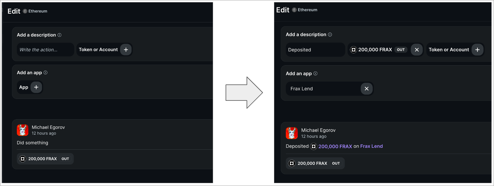
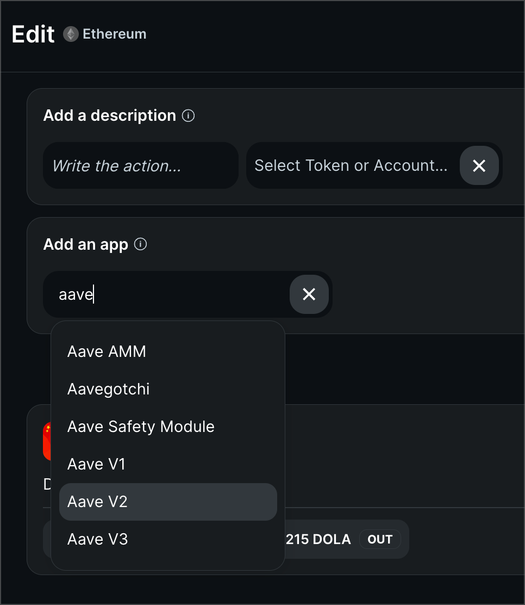
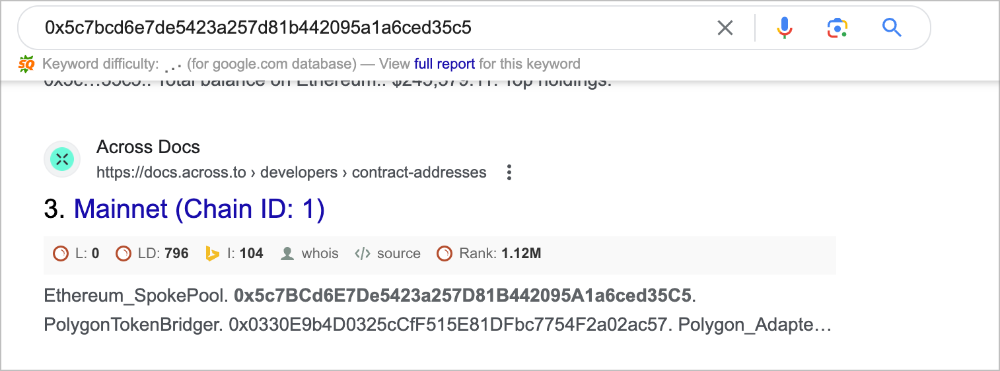
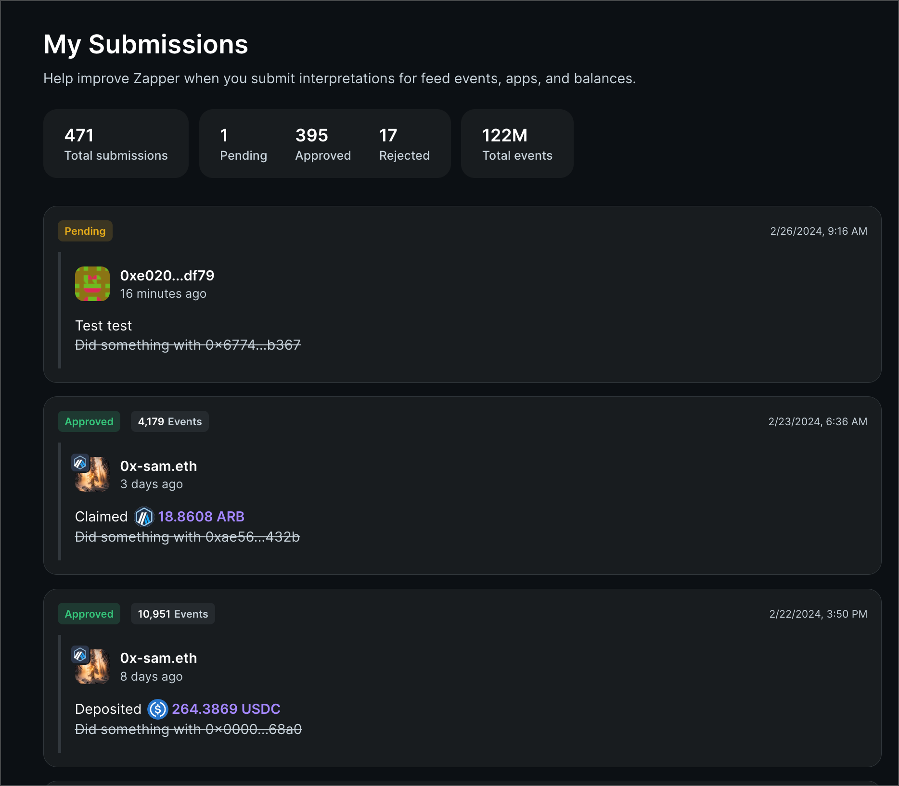

# Activity feed event interpreters

## What is an event interpreter?

Event interpretation is the process of translating complex onchain information into a **human-readable summary** for display on [Zapper's activity feed](www.zapper.xyz/feed).

With approximately 1,000,000 transactions processed daily on the Ethereum network, each transaction represents an onchain event encompassing various activities like mints, swaps, deposits, rugpulls, and more. Despite containing valuable information and context, transactions are often challenging to parse due to factors like logs, methods, internal transactions, and obfuscation caused by business logic and gas optimizations.

Zapper aims to address this issue by providing scalable tools for event interpretation. Users can leverage Zapper's building blocks to create understandable transaction summaries, assuming they have a general understanding of the transaction's purpose. By utilizing pre-populated drop-down menus and free-form text boxes, users can effectively fill out the transaction details.

## How event interpretation works

First, we assume that you have knowledge of what the transaction was generally about, such as “in this transaction, the user borrowed 500,000 FRAX on Frax Lend”. Equipped with that knowledge, you can then fill out the transaction using the pre-populated drop-down menus and free-form text boxes.

*Example of what interpreting an event looks like before and after. [Link to the above event on Zapper.](https://zapper.xyz/event/ethereum/0x319b0a720cc0cac120d021a267f1070ed4e5eb03784f39cd8c642ef2664cbdac)*

Even more so, once a user tells us how to interpret a specific transaction, like borrowing $FRAX on Frax Lend, we can then use this description template to describe ALL events where users are borrowing $FRAX on Frax Lend, not just the one being interpreted. In fact, we see that each event interpretation approved goes on to describe an average of **10,000 transactions** on Ethereum, which are then consumed by all users consuming the activity feed on Zapper.

## Event interpretation mechanics

There are 3 different areas to fill in the info for an uninterpreted transaction (and you don’t need to fill in all of them if its not needed)

The areas are:

- The initial verb
- Token transfers or accounts involved
- The app that this transaction took place through

### The initial verb

This is generally going to be the verb describing the action taken by the account that initiated this transaction. Common verbs for onchain transactions are “deposited”, “minted”, “swapped”, “claimed”, “borrowed”, etc. However, these can get more complex if needed, such as “Bought a Powershart Pack”, “Toggled nesting”, or “Bought a raffle ticket”. The main goal is to accurately describe what action was taken in this transaction by the initiator of it.

### Token transfers or accounts involved (optional)

This is a drop-down menu where Zapper pre-populates 2 types of information for you to use to describe the transaction:

- Token transactions that flowed into or out of the “from” account in the transaction (i.e. the initiator of the transaction) and the “to” account in the transaction (which is generally the counter-party of the transaction, but not always!)
- Accounts involved in the transaction, including intermediaries beyond the “to” and “from” accounts. These accounts could be NFT collections, externally owned accounts (e.g. manually-controlled wallets by humans), multi-sigs or any other type of smart contract

Note that you do not need to use all every account or token transfer listed in the drop-down menu if it is not needed to describe the transaction. You could actually totally ignore using any of these in the description if it doesn’t add value! The more concise, the better in our minds.

### The app that this transaction took place through (optional)

This is a free-form input + drop-down menu, where all apps that Zapper has in our system are listed. You’ll find the big names like OpenSea, Aave, Uniswap, Blur, etc. in the list. If the transaction you are describing is associated with a web3 app, please select it from the list.

If you do not see the correct app on the suggestion list, please to type it in yourself, and we will add it on our backend!

Note that you do not need to associate the transaction with an app if no app was involved; if there is no app, just select the "no app" toggle. For example, if the transaction is just a user minting an NFT from a NFT collection, initiated directly from the NFT collection’s smart contract, and didn’t take place through OpenSea or some frontend, then there is no app to associate it with.

## Tips on how to investigate an event for interpretation

For a lot of transactions, it can be a bit tricky to understand exactly what the purpose of a transaction was if you do not know. The best place is to start by looking at your own activity feed timeline, and interpret any transactions that are rending as "did something". You can see your timeline here: <https://zapper.xyz/dashboard?tab=history>

However, if you're feeling adventurous, you can source popular, uninterpreted transactions from the [Curate page.](https://zapper.xyz/curate/events)

Pointers on how to understand what is happening in a transaction
-The `method` name is usually helpful in pointing you towards what action is taken. If the method name is `deposit`, its likely the user sent tokens away and deposited them in an app.
    - HOWEVER, methods can also be misleading, so do not blindly trust them! Most smart contracts are forks of other contracts, where the devs copy the contract, and tweak it for their needs, but do not update the method names. This can lead to situations where a `withdraw` function is really a `claim` function, or a `deposit` is really `locked funds for 2 years`. Zapper's goal is to accurately and clearly describe the blockchain, so please do be aware of this in your submissions!

- It often helps to look up what app a contract in a transaction is associated with. If you find that the contract relates to Aave, its a good chance the methods relating to supplying and withdrawing funds from a lending protocol. The best way to find out what app an contract belongs to is to Google the TO address

- If that fails, another good way to investigate what app owns a contract is to search it on Github, and look if it is in an app's Github repository (or of anther app has added it and labelled it in their repo). Example search query: <https://github.com/search?q=0x6774Bcbd5ceCeF1336b5300fb5186a12DDD8b367&type=code>

## Submission process

Once you’ve written your event interpretation, go ahead and submit it! Once you click submit, your event interpretation is sent to the Zapper team for review. Here’s how the review process works:

- We are generally reviewing to make sure the verbiage makes sense (e.g. is in the past tense). We may tweak the words submitted to align it with other event interpreters on the site
- If there is a new app we need to create to associate this event with, we’ll go ahead and make it
- If the submissions is all good to go, we will approve it, and your event interpreter will be deployed to Zapper’s site for all users to use!
- If the submission has some issues, we may reject it and include a reason for the rejection. Common rejection reasons are if the submission is a duplicate of another submission that was pending or if the action was too vague to understand

Note that you can monitor the status of your submissions and see rejection reasons in your My Submissions page, found at <www.zapper.xyz/my-submissions>.

## Events that cannot be interpreted at this time

- Multi-sig transactions - we are working on interpreting these events at-scale
- Proxy contract transactions, like transactions interacting with Maker’s DSProxy contracts. We’re also working on interpreting these at scale, but they are weird
- Events that have already been interpreted. Note that if you see something that is wrong, please ping in our [Discord](https://www.zapper.xyz/discord) and we can get it fixed up!
- Events interacting with smart contracts that do not have their ABIs verified. If you try to interpret one of these, you will get a pop-up informing you of this situation. We are working on indexing the ABIs internally to remove this blocker, so stay tuned!
